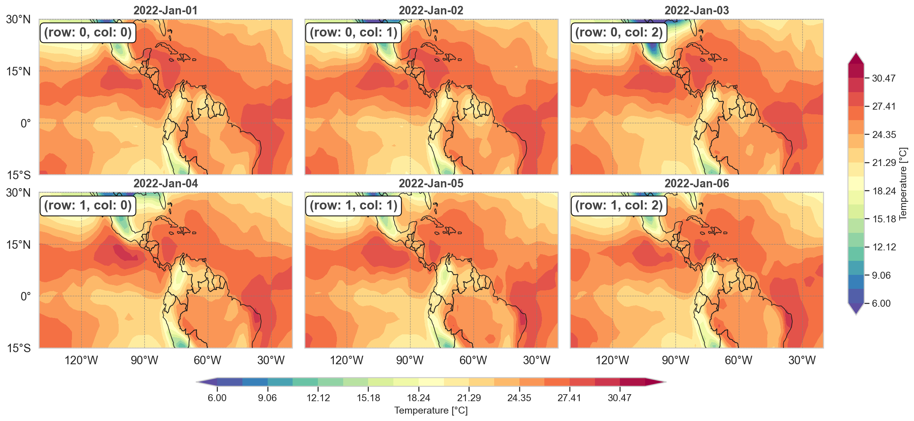
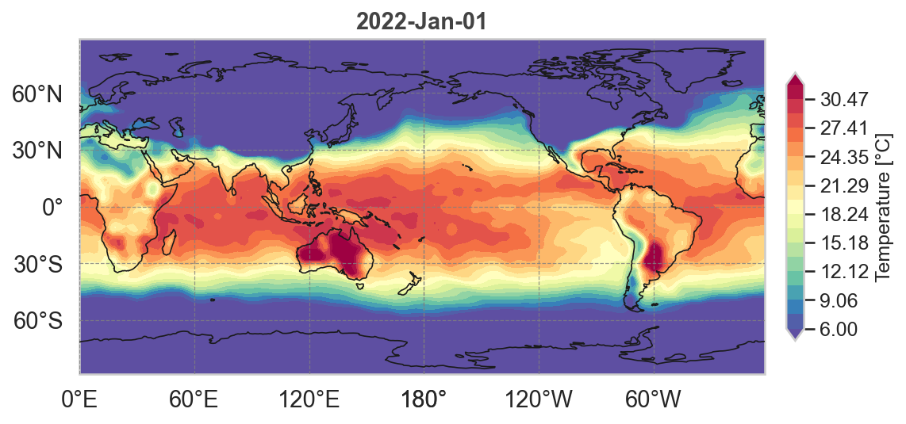
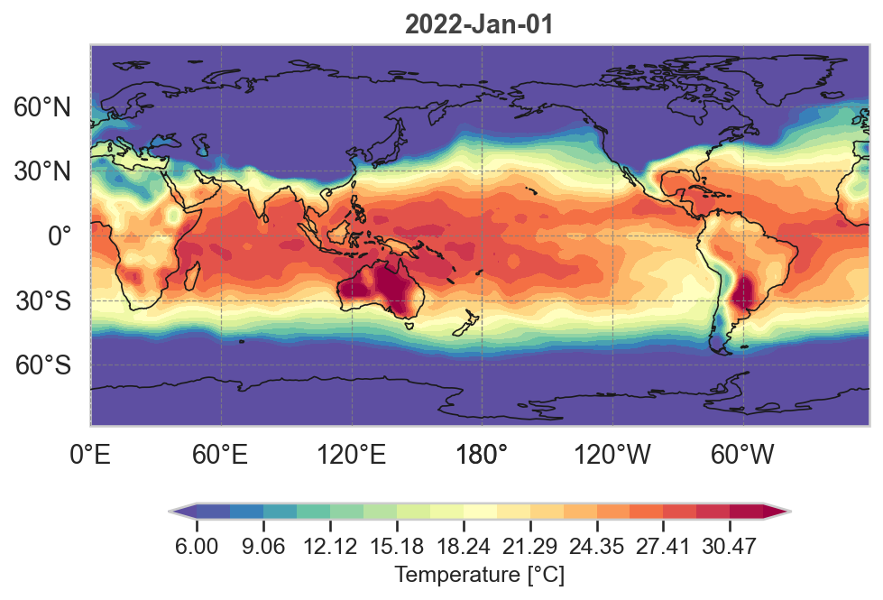
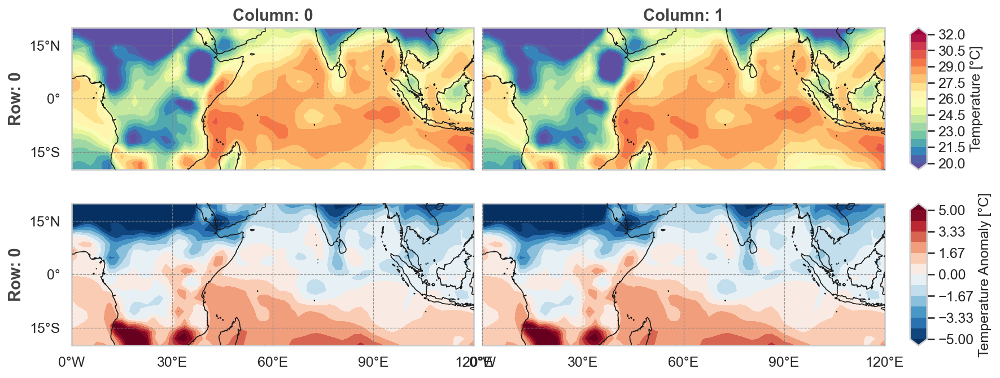
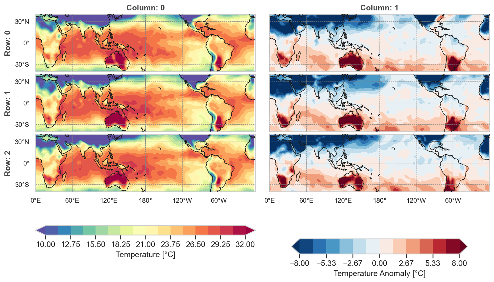

# CartoGrid

This Python module, `cartogrid.py`, generates a grid of subplots in a single figure, each containing a geographic plot of temperature data. The grid of subplots can be customized to have any number of rows and columns. Each subplot includes features like continents, coastlines, and gridlines. The module uses the cartopy library for geographic data manipulation and plotting, and the xarray library for handling the netCDF dataset.

## Examples

The `cartogrid` module generates highly customizable, grid-based geographic plots, as demonstrated in the examples below. These plots were produced using a surface temperature dataset from NCEP/DOE Reanalysis II. 

For step-by-step instructions on how to generate similar plots, please refer to the `tutorial.ipynb` notebook included in this repository.












## Functions

### Core Functions

* **`add_map_features(ax, lon_step=30, lat_step=15, map_resolution=50, countries=False, coastline=True, rivers=False, projection=None, **kwargs)`**: Adds geographic features (continents, coastlines, country borders, rivers), gridlines, and tick labels to a Cartopy axes. Supports custom styling through keyword arguments including colors, line widths, and font sizes.

* **`define_grid_fig(num_rows, num_columns, horiz_spacing=0.015, vert_spacing=0.05, **kwargs)`**: Calculates the coordinates and dimensions of subplots in a grid figure. Returns x-coordinates, y-coordinates, subplot width, and subplot height. Supports custom borders through keyword arguments.

### Colorbar Functions

* **`add_colorbar(fig, cs, label, orientation, grid_prop, cbar_factor=0.8, cbar_width=0.025, fontsize=12, **kwargs)`**: Adds a horizontal or vertical colorbar spanning the entire figure grid.

* **`add_colorbar_col(fig, cs, label, grid_prop, col_idx, cbar_factor=0.8, cbar_width=0.025, fontsize=12, **kwargs)`**: Adds a horizontal colorbar for a specific column in the grid.

* **`add_colorbar_row(fig, cs, label, grid_prop, row_idx, cbar_factor=0.8, cbar_width=0.025, fontsize=12, **kwargs)`**: Adds a vertical colorbar for a specific row in the grid.

## Usage

Basic workflow for creating gridded map figures:

1. **Import the module** and required libraries (cartopy, matplotlib, numpy, xarray).

2. **Define the map projection** (e.g., `ccrs.PlateCarree(central_longitude=0)`).

3. **Set the image extent** as a tuple `(lon_min, lon_max, lat_min, lat_max)`.

4. **Define the grid size** by specifying `num_rows` and `num_columns`.

5. **Calculate grid properties** using `define_grid_fig()`:
```python
   grid_prop = x_coords, y_coords, x_fig, y_fig = define_grid_fig(num_rows, num_columns)
```

6. **Create the figure** with desired size:
```python
   fig = plt.figure(figsize=(width, height))
```

7. **Create subplots** by looping through rows and columns:
```python
   for ri in range(num_rows):
       for ci in range(num_columns):
           ax = fig.add_axes([x_coords[ci], y_coords[ri], x_fig, y_fig], 
                            projection=projection)
           ax = add_map_features(ax, lon_step=30, lat_step=15, 
                                map_resolution=50, countries=True)
           ax.set_extent(img_extent, projection)
```

8. **Plot your data** on each axes (e.g., using `ax.contourf()`, `ax.pcolormesh()`, etc.).

9. **Add colorbars** using the appropriate colorbar function based on your layout needs.


## Requirements
This module requires the following Python libraries:

* cartopy
* numpy
* matplotlib
* xarray
* pandas
* seaborn


License
This project is licensed under the MIT License - see the LICENSE.md file for details
